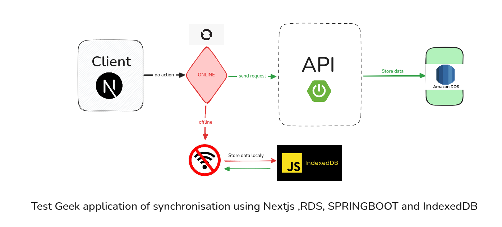

<h1>Application de synchronisation 💻 + 🔄 </h1>
 

    Le but de cette application est de mettre ne place un syteme de synchronisation avec une base de donnee distance , lorqu'il y'a la connexion
    , et de pouvoir sauvegarder les donnees lorsque la connexion n'existe plus , puis de le synchroniser à la detection d'une connexion

<h2>Cas Concret mise en place 📝 </h2>

Application todoLIst , cette application vas permettre à l'utilisateur de : 

<ul>
    <li>Creer une tache hors ligne et en ligne</li>
    <li>Connaitre le statut de sa connexion (onLine ou Offline)</li>
</ul>

<h3>Visualiser le swagger de cette api</h3>
<a href="http://localhost:8087/api/v1/swagger-ui/index.html">http://localhost:8087/api/v1/swagger-ui/index.html</a>

<h2>Architecture mise en place 🚀</h2>

Contributor : Nick Kengne , <i>FullStack Developer</i>  